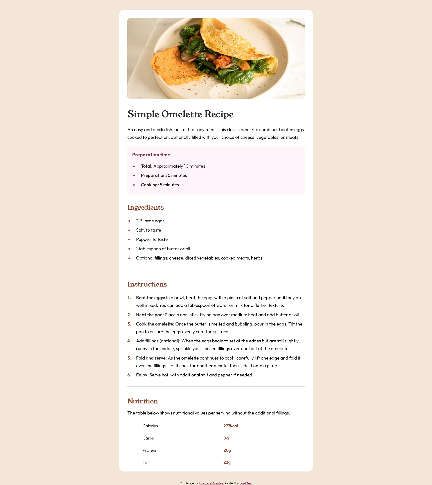

# Frontend Mentor - Recipe page solution

This is a solution to the [Recipe page challenge on Frontend Mentor](https://www.frontendmentor.io/challenges/recipe-page-KiTsR8QQKm). Frontend Mentor challenges help you improve your coding skills by building realistic projects. 

## Overview

### Screenshot

### Links

- Solution URL: [will add soon](https://your-solution-url.com)
- Live Site URL: [https://dev-paull.github.io/recipe-page](https://dev-paull.github.io/recipe-page)

## My process

### Built with

- Semantic HTML5 markup
- CSS custom properties
- Flexbox
- Mobile-first workflow

### What I learned

- Better understanding of tables and list styling

### Continued development

I completed this challenge relatively quickly and achieved a design that closely resembles the original (without access to any Figma files, only based on screenshots). However, I had to do some research on how to style lists and couldn't recall the exact method for styling tables.

